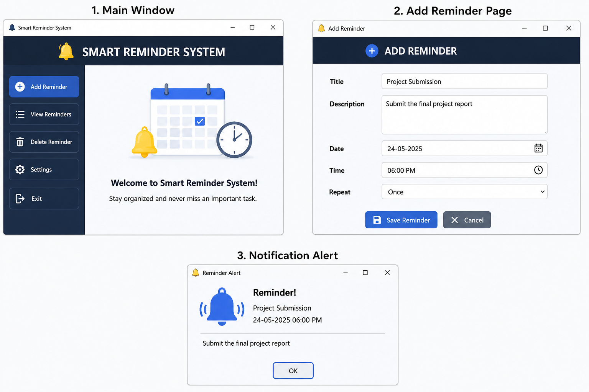

📋 Smart Reminder System
The Smart Reminder System is a Python-based application that helps users manage their daily tasks and schedules efficiently. It allows users to set reminders for important events and receive notifications at the specified time.

📖 OVERVIEW
The Smart Reminder System is designed to help users stay organized by managing reminders for tasks, meetings, assignments, and personal activities. The system stores reminder information and alerts users when the scheduled time arrives.

🎯 OBJECTIVES
Reduce the chances of missing important tasks
Improve time management
Provide timely notifications
Organize daily activities efficiently
Increase productivity

✨ FEATURES
🔔 Create reminders
⏰ Set date and time for reminders
📝 Edit reminders
❌ Delete reminders
📋 View all reminders
🔔 Notification alerts
💻 User-friendly interface

⚙️ HOW IT WORKS (METHODOLOGY)
Step 1: User opens the Smart Reminder System.
Step 2: User enters reminder details.
Step 3: User sets the reminder date and time.
Step 4: System stores the reminder.
Step 5: Notification is displayed when the reminder time arrives.

🛠️ TECHNOLOGIES USED
🐍 Python
🪟 Tkinter (GUI)
📅 Datetime Module
⏰ Time Module
🔔 Plyer Notification Library

✅ ADVANTAGES
Saves time
Improves task management
Easy to use
Reduces forgetfulness
Enhances productivity
Provides timely alerts
Efficient reminder tracking

🖥️ SYSTEM OVERVIEW AND DESIGN
## Main Window

## Add Reminder Page

## Notification Alert

